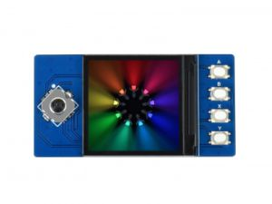

# pico-ai-assistant

An AI assistant project based on the Raspberry Pi Pico (RP2040) with a 1.3-inch LCD display.

## Requirements

- `cmake` >= 3.12
- `make`
- `arm-none-eabi-gcc` toolchain
- `sudo` (for flashing)

## Getting Started

### 1. Clone with submodules

```bash
git clone --recurse-submodules git@github.com:jooojub/jooojub-pico-ai-assistant.git
```

If you already cloned without submodules:

```bash
git submodule update --init
```

### 2. Build

```bash
make
```

The UF2 firmware image will be generated at `build/main.uf2`.

### 3. Flash

Hold the **BOOTSEL** button on the Pico and connect it via USB, then run:

```bash
make flash
```

This will automatically:

1. Detect the Pico (`RPI-RP2` device) — polls for up to 30 seconds
2. Mount it to `./RPI-RP2`
3. Copy `build/main.uf2` to the device
4. Run `sync` and `umount`

### 4. Clean

```bash
make clean
```

## Project Structure

```
.
├── main.c                  # Application entry point
├── CMakeLists.txt
├── Makefile
├── pico_sdk_import.cmake
├── pico-sdk/               # Submodule: raspberrypi/pico-sdk (v2.2.0)
├── lib/
│   ├── Config/             # GPIO, SPI, I2C, PWM config
│   ├── LCD/                # LCD drivers (1.3-inch 240x240)
│   ├── OLED/               # OLED drivers
│   ├── GUI/                # Paint / drawing primitives
│   ├── Fonts/              # Bitmap fonts
│   ├── Icm20948/           # IMU driver
│   └── Infrared/           # Infrared button driver
└── examples/
    ├── LCD_1in3_test.c     # LCD 1.3-inch demo
    └── ImageData.c         # Image assets
```

## Hardware

### Pico-LCD-1.3



1.3inch LCD Display Module for Raspberry Pi Pico, 65K Colors, 240 × 240, SPI

| Item      | Value                         |
| --------- | ----------------------------- |
| Board     | Raspberry Pi Pico             |
| Platform  | RP2040                        |
| Display   | 1.3-inch LCD 240×240 (ST7789) |
| Colors    | 65K (RGB565)                  |
| Interface | SPI                           |

**Reference:** https://www.waveshare.com/wiki/Pico-LCD-1.3
